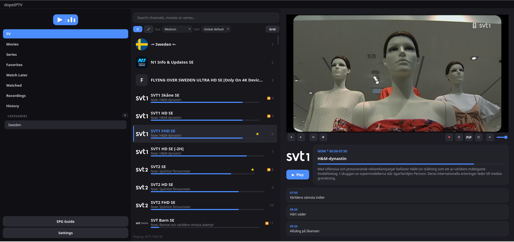
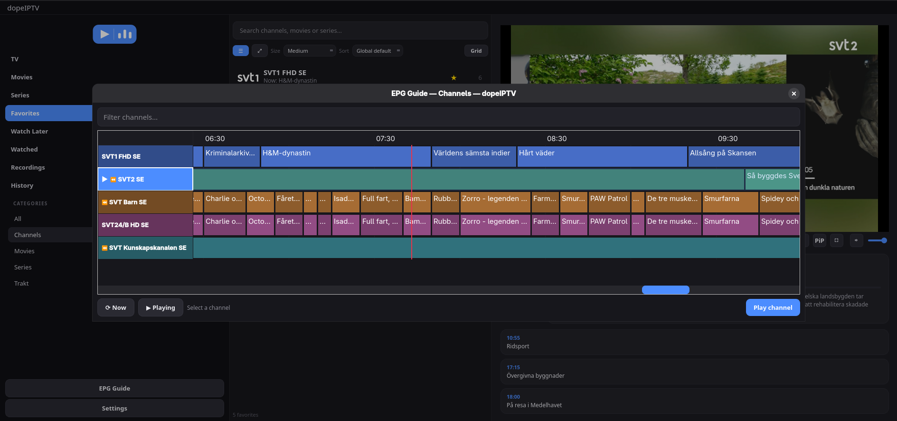
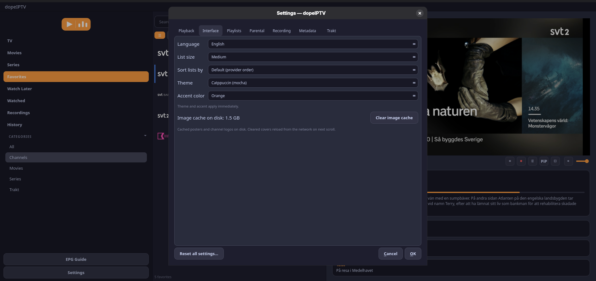
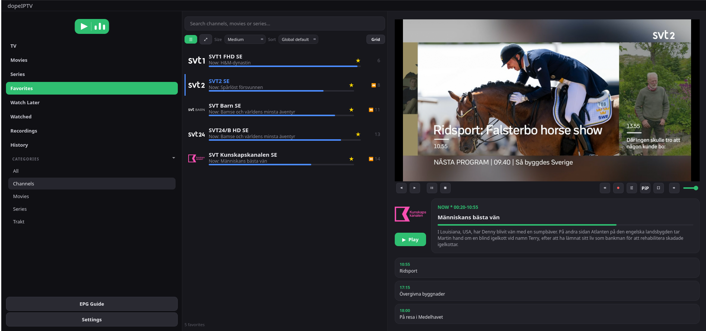

# dopeIPTV

I was looking for a good IPTV-client on Linux but couldn't find one. So I vibe
coded dopeIPTV based on what I think is a good IPTV-player. I think you will
like it.

It's primarily for Linux (works okay on macOS) with a modern dark interface,
supporting the **Xtream Codes API** and **M3U playlists**, **EPG**, and an
**embedded mpv** video player (with optional external mpv/VLC playback).

> **dopeIPTV is a player, not a content source.** You connect it to a service
> you already subscribe to (an Xtream Codes account or an M3U playlist) — it
> doesn't provide any channels itself. The built-in **demo channels** are free,
> public test streams so you can try the app with nothing to configure.

## Screenshots

|  |  |
|---|---|
|  |  |
| *Live TV with the programme guide* | *EPG timeline grid* |
|  |  |
| *Themes — 5 palettes + 7 accents* | *Favorites and the embedded player* |

## Features

- **Embedded video** via libmpv's OpenGL render API — plays right inside the app on any compositor (GNOME, KDE, Hyprland, ...), with fullscreen, Picture-in-Picture, a hover scrubber and arrow-key seeking
- **TV, Movies & Series** with seasons/episodes, favorites, history, and instant search across thousands of channels
- **8 languages** — English, Svenska, Español, Deutsch, Français, 中文, Русский, ไทย — switchable live in Settings
- **Resume playback** — movies/series/recordings remember where you stopped and offer to continue
- **Full EPG** with now/next progress bars, a searchable guide, and a persistent disk cache that shows instantly on startup
- **TMDB metadata** — posters, ratings (linked to IMDb), and a clickable cast list that finds an actor's other titles in your playlist
- **Recording & Timeshift** — record on a timer/schedule (single-connection friendly) and watch catch-up archives from the EPG
- **Chromecast**, **Trakt** scrobbling, **multiple playlists**, parental control, content manager and editable channel lists
- **Themes** — 5 palettes + 7 accent colors, applied live

See [FEATURES.md](docs/FEATURES.md) for the full feature list.

## Dependencies

dopeIPTV's embedded player is built around **libmpv** and its Record/Cast
features around **ffmpeg** and **pychromecast**, so these are required, not
optional:

| Component | Provides | Required |
|---|---|---|
| `python3` (≥ 3.11) | runtime | ✅ |
| `mpv` / `libmpv` | embedded video playback | ✅ |
| `python-mpv` | Python binding to libmpv | ✅ (pip) |
| `ffmpeg` | recording backend | ✅ |
| `pychromecast` | Chromecast casting | ✅ (pip) |
| `vlc` | optional *external* player only | ⬜ |

The Python packages (`PyQt6`, `requests`, `python-mpv`, `pychromecast`) are
installed automatically by pip/pipx from `requirements.txt`. The system
packages (`mpv`, `ffmpeg`, and optionally `vlc`) come from your distro.

## Installation

### Option A — AppImage / Flatpak / .deb (easiest, no dependencies to install)

Download the latest package for your system from the
[Releases page](https://github.com/slimture/dopeIPTV/releases) — a
self-contained `dopeIPTV-*.AppImage`, a `.deb` for Debian/Ubuntu, or a
`.flatpak`. For the AppImage:

```bash
chmod +x dopeIPTV-*.AppImage
./dopeIPTV-*.AppImage
```

The AppImage bundles Python, PyQt6, libmpv, and ffmpeg — nothing else to
install, and the **embedded** player works out of the box. (To integrate it
into your application menu, use a tool like
[Gear Lever](https://flathub.org/apps/it.mijorus.gearlever) or AppImageLauncher.)

> **Note — "Open externally" needs a system player.** The built-in embedded
> player is fully self-contained. But the right-click **Open externally**
> option (and the separate-window mpv mode) launches a *standalone* `mpv` or
> `vlc` from your system, so those features only work if you have `mpv`
> and/or `vlc` installed via your distro:
>
> ```bash
> sudo apt install mpv vlc      # Debian/Ubuntu
> sudo dnf install mpv vlc      # Fedora
> sudo pacman -S mpv vlc        # Arch
> ```

### Option B — install from source with pipx

```bash
git clone https://github.com/slimture/dopeIPTV.git
cd dopeIPTV
./install.sh
```

`install.sh` detects your package manager (apt / dnf / pacman), installs the
system dependencies, then installs dopeIPTV with `pipx`.

To do it manually instead:

```bash
# Debian/Ubuntu
sudo apt install python3 python3-pip pipx mpv ffmpeg   # add vlc for external playback
# Fedora
sudo dnf install python3 python3-pip pipx mpv ffmpeg
# Arch
sudo pacman -S python python-pipx mpv ffmpeg

pipx ensurepath
pipx install .

```
pipx install . will install PyQt6, requests, python-mpv, pychromecast

## Running

```bash
dopeiptv
```

The first time, enter your Xtream server (e.g. `http://server:8080`),
username, and password.

## Add to the application menu (optional)

```bash
mkdir -p ~/.local/share/applications
cp dopeiptv.desktop ~/.local/share/applications/
update-desktop-database ~/.local/share/applications
```

The application icon is installed automatically to `~/.local/share/icons`
the first time the app starts.

## Usage

| Action | How |
|---|---|
| Play | Double-click, or the **▶ Play** button in the detail panel |
| Pause / stop / volume | The player bar buttons + the volume slider & mute |
| Seek (movies/series/catch-up) | Hover the video for the scrubber, or click the video and use ← / → (tap = ±10s, hold = continuous) |
| Resume where you left off | Prompted automatically when you replay a movie/episode |
| Audio track / subtitles / aspect / buffer | The ⚙ button in the player bar (also in fullscreen) |
| Stats for nerds | ⚙ → Stats for nerds (live overlay on the video) |
| Fullscreen | Double-click the video, or press `F` — `Esc` to leave |
| Picture-in-Picture | The **PiP** button in the player bar |
| Zap to next/previous channel | Ctrl+Right / Ctrl+Left |
| Rename / hide a channel | Right-click it |
| Open in an external player (mpv/VLC) | Right-click → Open externally |
| Record a channel | Right-click → Record (or the ● REC button in the player) |
| Stop a recording | Click the red ● REC indicator under the list |
| Change theme / accent color | Settings → Interface |
| Watch a programme from the start | Right-click a ⏪ channel → Timeshift |
| Browse the full guide | The **EPG Guide** button in the sidebar |
| Search | Type in the search field at the top |
| Switch account | Settings → "Switch account / server" |

## Troubleshooting

- **Embedded playback disabled** — install `mpv`/`libmpv` and `python-mpv` (see Dependencies). Not needed for the packaged AppImage/.deb/Flatpak, which bundle the embedded player.
- **"Open externally" does nothing** — the external-player options launch a standalone `mpv` or `vlc` from your system; install one (`sudo apt install mpv vlc`). The embedded player does not need them.
- **Recording does nothing** — install `ffmpeg`; it is the recording backend.
- **Live stream won't start** — try switching the live format to `m3u8` in Settings.
- **No categories** — check the server URL (include the port, e.g. `:8080`).
- **No EPG for a channel** — the provider may not have a programme guide mapped to it; dopeIPTV tries three different sources (short EPG, full EPG table, XMLTV) before giving up.

## Language

dopeIPTV ships with translations for **English, Svenska, Español, Deutsch,
Français, 中文, Русский and ไทย**. Pick your language under
**Settings → Interface → Language**. Menus, the sidebar, settings and
notifications switch immediately.

## License

dopeIPTV is free software, released under the **GNU General Public License
v3 or later (GPL-3.0-or-later)** — see [`LICENSE`](LICENSE).

It builds on GPL/LGPL components including **mpv/libmpv**, **FFmpeg**,
**PyQt6** and optionally **VLC**. GPLv3 is the licence that is compatible
with all of them; see [`THIRD-PARTY-LICENSES.md`](docs/THIRD-PARTY-LICENSES.md)
for the full rationale and the licence of every dependency.

This product uses the TMDB API but is not endorsed or certified by TMDB.
dopeIPTV does not include or distribute any media, playlists or channel
data — you supply your own provider.
